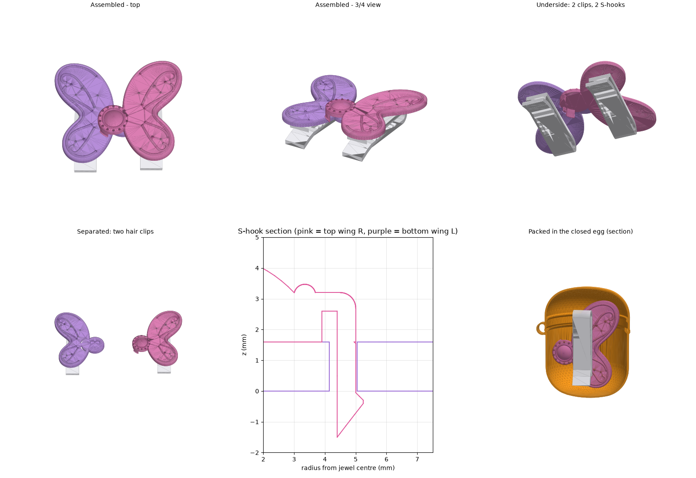
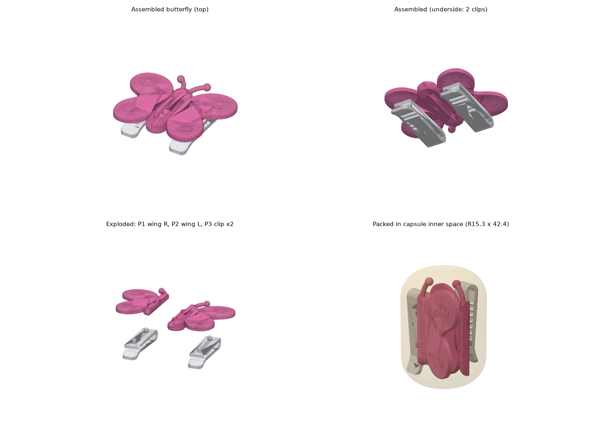
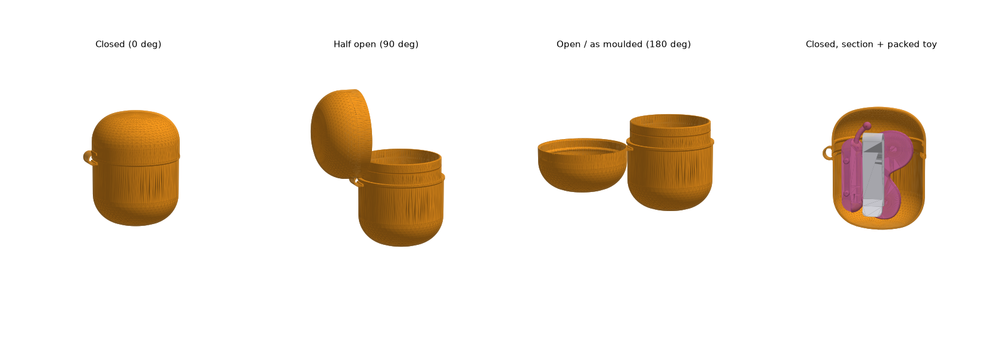
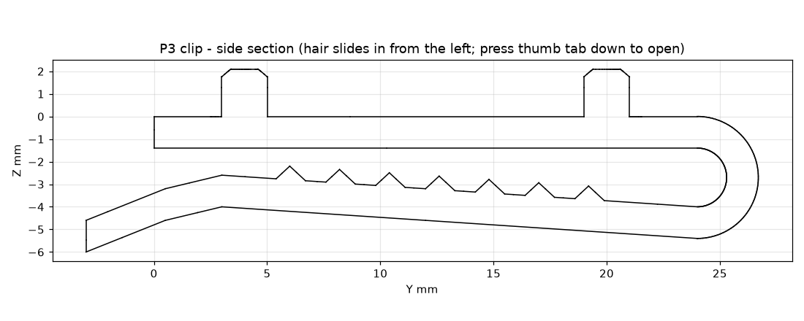

# 健达奇趣蛋玩具 v2：「童话公主」蝴蝶发卡

4 个零件，注塑 ABS，**没有金属件**，**所有模具都是直出模（不需要滑块或斜顶）**。两只翅膀合起来是一只蝴蝶；拆开就是两个发卡，可以分给朋友。

## 1. 在 Rhino 9 里生成 NURBS 模型

1. Rhino 9（7 / 8 也可以）→ 命令行输入 `RunPythonScript` → 选择 **`rhino/kinder_rhino_build.py`**。也可以在 ScriptEditor 里打开后运行，IronPython 和 CPython 3 都行。
2. 脚本会用 RhinoCommon 从零建模：
   - 样条外形：翅膀外轮廓是周期三次 NURBS，花纹是插值样条加圆管。
   - 布尔运算：并集、差集、交集。
   - 圆角：`CreateFilletEdges`。
   
   结果全部是闭合的 NURBS 多重曲面，分在 `KinderToy` 下的各个子图层里。
3. 所有参数都在文件顶部的 `BF` 字典（蝴蝶）和 `EGG` 字典（蛋壳）里，改完重新运行即可，上一次生成的物体会先被自动删除。
4. 如果命令行出现 `!!` 警告（某个布尔运算或圆角失败），出问题的物体会放到 `_Debug` 图层。请把命令行输出发给我。
5. 备用方案：`out/princess_wing_R.step`、`princess_wing_L.step`、`princess_clip.step`、`princess_assembly.step` 是 CadQuery 按同一套参数生成的 NURBS 实体，可以直接导入 Rhino。

## 2. 零件

| 编号 | 零件 | 尺寸 (mm) | ABS 重量 | 单独戴时的样子 |
|---|---|---|---|---|
| P1 | 右翅膀（上层） | 27.1 × 35.5 × 6.0 | 1.01 g | 根部是一颗凸起的宝石（弧面宝石 + 包边 + 14 颗珠子）；两个 S 钩藏在底面 |
| P2 | 左翅膀（下层） | 27.1 × 35.5 × 3.5 | 0.95 g | 根部圆章上有下凹的爱心；靠近根部有两道月牙形镂空（卡扣用） |
| P3 | 发夹 × 2（同一零件） | 7.0 × 29.7 × 8.1 | 0.63 g | 一体式 ABS 弹片夹，两个翅膀通用 |

- **外形**：上翅大而上扬，下翅小而收拢，轮廓流线。两只翅膀根部各有一个 Ø10 的圆章，合体时两个圆章错开重叠，就是你草图里的“OO”，中间那颗宝石就是蝴蝶的身体。
- **表面纹理**：内侧描边、卷草状的翅脉和珍珠点，都凸起约 0.3 mm、两头圆滑。顶面整面都可以喷 UV 感光变色涂层：大面积光滑区域变色均匀，凸起的纹理会形成明暗层次。

## 3. 翅膀互锁结构（按你草图里的 S 形截面）

- 合体时，右翅膀的宝石圆章**叠在**左翅膀根部的上面。
- 右翅膀圆章边缘往下伸出 **2 个弹性钩**（分别在 130° 和 230° 的位置），穿过左翅膀上的 **2 条弧形槽**，钩唇从下面勾住左翅膀的底面。截面就是 S 形互锁（见总览图中间下方那张截面图）。
- **安装**：把宝石对准左翅膀根部，按下去，“咔”一声就卡住。**拆开**：捏住两只翅膀往上掰开。
- **限位**：钩唇防止向上脱开；钩背靠在槽的外边，防止往外滑；每个钩旁边还有一个刚性**定位键**卡在槽的内边，防止往里滑；弧形槽的两端限制转动。
- **注塑（直出模）**：
  - 钩唇朝外（径向向外），正上方没有右翅膀的材料，型腔可以直接从上方成型。
  - 钩子内侧有一条从底面开的减压槽，让钩子更长、更软。
  - 左翅膀上只有通槽，同样是直出模。
- **强度**：钩子扣合时需要变形 0.2 mm，钩子有效长度 2.9 mm、厚 0.6 mm，应变约 **2.1 %**，在 ABS 卡扣允许的约 2.5 % 以内。
- **拆开后的外观**：
  - 右翅膀：正面是完整的宝石，钩子在底面，戴上看不见。
  - 左翅膀：根部是爱心圆章加两道细月牙镂空，看起来像装饰的一部分。
  - 合体时：左翅膀的槽几乎完全被宝石圆章盖住。

## 4. 发夹
沿用 v1 的一体式 U 形弹片夹：齿形弹舌加拇指按片，弹性来自 ABS 本身，应变约 0.8 %。发夹上的两根销按进翅膀底面凸台里的盲孔。两只翅膀的凸台位置是镜像的，所以同一个发夹两边都能用。注意：发夹尾部的拇指按片会从翅膀下沿露出约 2–3 mm，这是故意留给小朋友按的。

## 5. 验证（云端没有 Rhino，用 OpenCascade 按同一套数学复建）
- `verify_princess.py` 的结果：
  - 3 个零件都是有效的单一实体。
  - 组装后两只翅膀零干涉（只是面接触）；发夹销孔的 0.05 mm 过盈是有意设计的。
  - 两个 S 钩的钩唇 **100 %** 位于左翅膀底面之下，啮合量 0.2 mm。
  - 4 个零件装进**真实蛋壳模型**（闭合状态）后零干涉，最小间隙 **1.38 mm**。排布位置写在脚本的 `PACK` 里。
- `check_princess()`（纯 Python）检查了：
  - 发夹凸台离翅膀边缘足够远。
  - 弧形槽四周至少留有 1.27 mm 的材料。
  - 钩唇正上方没有右翅膀的材料（保证直出模）。
  - 左翅膀上被右翅膀压住的区域没有凸起的装饰，所以两只翅膀能贴平。
- 用模拟的 RhinoCommon 环境跑完了整个脚本（21 个物体），确认没有拼写错误或变量未定义。真实 Rhino 中的布尔运算和圆角是否成功，需要你在 Rhino 9 里跑一次确认。

## 6. 注塑与安全要点
| 项目 | 做法 |
|---|---|
| 材料 | ABS（右翅膀和左翅膀可以用两种颜色，比如粉色和淡紫色），顶面喷 UV 感光变色涂层；发夹用白色 ABS |
| 模具 | 每个零件都是两板模直出：翅膀沿 Z 方向开模，发夹沿 X 方向开模、分型面在中线 |
| 壁厚 | 翅膀 1.6 mm，钩子 0.6 mm，凸台 1.5 mm；宝石下方是实心的 |
| 安全 | 翅膀顶边圆角 R0.5，装饰件都是圆头，没有尖角；全部零件不含金属 |
| 法规 | 需要通过 EN 71-1/2/3、ASTM F963 认证；包装警示“3 岁以下儿童不宜”；UV 涂层需要做迁移测试（EN 71-3） |

---

# 附录：v1 设计（销钉连接版，已被 v2 取代）

## 蛋壳模型（v2 沿用）

**`rhino/kinder_rhino_build.py`** 用 RhinoCommon 从零建出全部模型，结果都是 Rhino 原生的闭合多重曲面（NURBS）：
- **蛋壳**：带 0.68 mm 壁厚，有闭合（0°）、半开（90°）、全开（180°，即注塑时的状态）三个状态，外加一个闭合剖面（里面放着装好的蝴蝶零件）。
- **蝴蝶**：P1 右翅膀、P2 左翅膀、P3 发夹，以及组装状态和装蛋排布。

运行方法：Rhino 7 或 8 → 命令行输入 `RunPythonScript` → 选择这个文件。Rhino 8 也可以在 ScriptEditor 里运行，IronPython 或 CPython 3 都行。

- **全部参数在文件顶部**：`EGG`（蛋壳）和 `BF`（蝴蝶）两个字典。改完重新运行即可，上一次生成的物体会先被自动删除。
- **建模方式**：
  - 外形用样条：翅膀外轮廓是周期插值样条，触角是样条路径的圆管。
  - 实体用旋转 / 拉伸，再做布尔运算：蛋壳 = 外形 − 内腔，卡扣环用并集，卡扣槽用圆环体差集，翅膀上下搭接靠盒体切分。
  - 圆角用 `CreateFilletEdges`：身体顶部 R2、底部 R0.6，翅膀上表面边缘 R0.5。蛋壳两端的 R11.18 / R11.51 圆角在截面轮廓里用精确圆弧建出。
- **图层结构**（父图层 `KinderToy`）：
  - `Egg_Closed` / `Egg_HalfOpen` / `Egg_Open`：蛋壳三个状态
  - `Egg_Closed_Section`：闭合剖面，在 Front 视图里能看到内部
  - `Butterfly_Assembly`：蝴蝶组装状态
  - `Butterfly_Parts`：单个零件
  - `Packed_In_Egg`：装蛋排布
  - `_Debug`：只有布尔运算失败时才会有内容
- 每个物体都写了 User Text（生成器名称、主要参数）。如果文档单位不是毫米，脚本会自动换算。
- 闭合状态下，盖子的卡扣环和底座的卡扣槽之间有 0.12 mm 的过盈（这是有意设计的卡扣），所以闭合状态输出为 **底座+铰链** 和 **盖子** 两个实体。半开和全开状态下盖子和底座不接触，输出为一个整体（一次注塑成型）。

### 蛋壳尺寸（取自图纸，均为参数）
| 参数 | 数值 | 来源 |
|---|---|---|
| 闭合总长 | 45.32 | 图纸 |
| 壁厚 | 0.68 | 图纸 |
| 盖子外半径 / 端部圆角 | 17.32 / R11.18 | 图纸 |
| 底座外半径 / 端部圆角 | 17.03 / R11.51 | 图纸 |
| 底座分模处凸缘外半径 | 17.44 | 图纸 |
| 底座颈口外半径（插进盖子里） | 16.02 | 图纸 |
| 两端球面 | R35.31 | 图纸（我按端部球面理解） |
| 盖口内倒角 | 0.66 × 30° | 图纸 |
| 底座深度（到分模线）/ 颈口高度 | 27.9 / 8.0 | 按图纸比例量取，闭合总长 = 45.32 已核对 |
| 卡扣：盖内凸环 R15.90，颈口凹槽深 0.15 | 设计值 | 图纸里只能看出位置，具体尺寸是我定的 |
| 活动铰链：带厚 0.5、宽 6、弯曲半径 2.2 | 设计值 | 图纸 PART I 没有标注尺寸 |

注意：
- 铰链在三个状态下是按“绕轴弯曲的圆弧带”来表示的，只用来展示开合状态，不是真实的弯曲变形仿真。
- 健达蛋壳本身通常是 PP 材料，底座颈口内侧有约 1 mm 的倒扣，需要强脱或者用收缩型芯脱模（在 `egg_base_inner` 里可以改）。

### 验证
云端环境没有 Rhino，所以脚本里所有几何数学（截面轮廓、铰链、发夹轮廓）都是纯 Python 写的。`verify_rhino_math.py` 用同一套函数在 CadQuery（OpenCascade）里复建了一遍，并检查了以下几点：
- 所有截面轮廓首尾连续。
- 闭合总长为 45.32。
- 三个状态都是有效的单一实体，开合过程中盖子和底座不碰撞。
- 装好的 4 个蝴蝶零件全部在**真实蛋壳内腔**里，和壳体零干涉，最小间隙 1.24 mm。

验证生成的 `out/egg_Egg_*.step` 可以作为对照。脚本里 RhinoCommon 的 API 调用本身没法在云端运行；如果在 Rhino 里出现 `!!` 警告，请把命令行输出发给我。

## 1. 文件

| 文件 | 说明 |
|---|---|
| `out/kinder_butterfly_clip.3dm` | Rhino 7/8 文件，单位为毫米，网格预览。图层：`01_Assembly` 是组装状态，`02_Parts_flat` 是单个零件，`03_Packed_in_egg` 是装进蛋里的排布，`04_Capsule_inner_space_ref` 是蛋壳内腔参考 |
| `out/P1_wing_R.step` / `P2_wing_L.step` / `P3_clip.step` | **NURBS 实体**。在 Rhino 里用 `Import` 导入，得到闭合多重曲面，可以继续编辑或拔模，也可以直接交给模具厂 |
| `out/butterfly_assembly.step` | 组装好的总装 STEP（带颜色） |
| `out/*.stl` | 3D 打印手板用 |
| `out/capsule_inner_space.step` | 按图纸换算出的蛋壳内腔（偏保守） |
| `build.py` / `pack.py` / `render.py` | 参数化源文件：改尺寸后重新运行就能重新生成所有文件，并重新做装蛋检查 |

重新生成的方法：`pip install cadquery rhino3dm trimesh matplotlib`，然后依次运行 `python build.py && python pack.py && python render.py`。

## 2. 零件清单（共 4 件，3 套模腔，可做成一副家族模）

| 编号 | 零件 | 数量 | 外形尺寸 (mm) | 体积 / ABS 重量 | 主要功能 |
|---|---|---|---|---|---|
| P1 | 右翅膀（带下半身体 + 2 根合体销） | 1 | 26.5 × 35.8 × 5.2 | 1470 mm³ / 1.54 g | 单独就是一个发卡；合体时承托左翅膀 |
| P2 | 左翅膀（带上半身体 + 2 个合体孔） | 1 | 22.5 × 35.8 × 4.5 | 1110 mm³ / 1.17 g | 单独就是一个发卡 |
| P3 | 发夹 | 2（同一零件） | 7.0 × 29.7 × 8.1 | 595 mm³ / 0.62 g | 一体式 ABS 弹片夹，插在任意一个翅膀下面 |

- 合体后整只蝴蝶约 **45 × 36 × 10.5 mm**（含发夹）。
- 两个发夹是**同一个零件**，所以左右通用，只需要开一个模腔（或者一模两穴）。

## 3. 结构原理（越简单越好）

### 3.1 翅膀合体：上下搭接 + 2 根压入销
- 蝴蝶身体宽 8 mm、高 5 mm，在 **Z = 2.2 mm 处水平分成上下两层**：
  - **P1 右翅膀**：拿到整条下半层（左右都有，作为“搭接舌”）和右边的上半层。
  - **P2 左翅膀**：只拿左边的上半层。
- 搭接舌上有 **2 根 Ø2.05 的销**，P2 下面对应 **2 个 Ø2.00 的孔**（0.05 mm 过盈），销头和孔口都有 0.3 mm 导向倒角。
- **安装**：把左翅膀放在右翅膀的身体上，对准两个点按下去就合体了；用手掰开就能分开。两根销还能防止左右翅膀转动。
- 所有销和孔都是**竖直方向（和开模方向一致）**，翅膀模具是**两板模直顶，不需要滑块和斜顶**。

### 3.2 发夹：一体式 U 形弹片夹（无金属弹簧）

- 上臂（厚 1.4）通过 U 形弯头（内 R1.3）连到下面的弹舌（厚 1.4，自由长约 21 mm）。
- 弹舌上有 7 条防滑齿，齿顶和上臂之间约 0.8 mm 的间隙。头发塞进去后会把弹舌往下压，ABS 的弹性把头发夹住。
- 尾端有一个**向下翘的拇指片**：用手指按下去就张开，头发从开口那头滑进去。
- 应变校核：夹 2 mm 一束头发时弹舌挠度约 1.5 mm，应变 ε ≈ 1.5·t·δ/L² ≈ **0.8 %**，ABS 可以反复弹性使用（极限约 2 %）。
- **模具**：整个发夹是“侧面轮廓 + 沿 X 方向拉伸”，**分型面在宽度中线（X = 3.5）**，两半模沿 ±X 直接拉开，安装销正好被分型面从中间剖开。整件**没有倒扣，不需要任何滑块**。

### 3.3 发夹装到翅膀上：2 根压入销
- 发夹上臂顶面有 **2 根 Ø2.25 的销**（间距 16 mm），翅膀底面的 Ø5 凸台里有 **Ø2.20 的盲孔**（深 2.3，孔口有导向倒角）。
- 左右翅膀的凸台位置是镜像的，所以**同一个发夹**可以装到任意一个翅膀下面。
- 孔做成盲孔、凸台高 1.5 mm，翅膀正面看不到孔，也不会缩水。

## 4. 小朋友的玩法 / 安装说明
1. 把发夹的两根小柱子对准翅膀背面的两个圆凸台，按下去，“咔”一声就装好了（两个翅膀各装一个）。
2. 把左翅膀叠到右翅膀的身体上，对准两个点按下去，就变成一整只蝴蝶（下面有两个夹子，戴起来更稳）。
3. 想分享给朋友：把两只翅膀掰开，就是**两个独立的发卡**，每个都带自己的夹子。
4. 戴的时候：按下发夹尾部的小片，把一小撮头发从开口滑进去，松手。

## 5. 装进健达蛋（已用程序校验）
- 按图纸换算出的内腔（偏保守）：外长 45.32 减两层壁厚 0.68 → **内长取 42.4**；下半壳内半径约 15.9 → **取 R15.3**（相当于四周再留 0.3–0.6 mm 余量）；两端圆角按图纸 R11.18 → **取 R10.5**；端部的穹顶多出来的空间没有计入。
- 排布方式：两个翅膀**背靠背叠在中间**（间隙 0.3），两个发夹**分别放在两侧的弓形空间里**，所有零件的长度方向都沿蛋的轴线。
- `pack.py` 的校验结果：所有零件网格点都在内腔里面，零件之间**零干涉** → `PACKING OK`。

## 6. 注塑 / DFM 要点（ABS）
| 项目 | 数值 / 做法 |
|---|---|
| 材料 | ABS（与健达常用材料一致），可以用两种颜色：翅膀粉色，发夹白色 |
| 主体壁厚 | 翅膀 1.8 mm，发夹 1.4 mm，身体 2.2–2.8 mm；P1 身体底部已掏空，避免缩水 |
| 开模方向 | P1 / P2 沿 Z 方向，两板模；P3 沿 X 方向，分型面在中线 |
| 倒扣 | **零件上都没有倒扣，不需要滑块** |
| 拔模 | 凸台 1°，合体销 0.5°；翅膀外轮廓只有 1.8 mm 高，可以按 0.5° 在模具上补拔模（建议在 Rhino 里用 `DraftAngleAnalysis` 检查） |
| 配合 | 销-孔过盈 0.05 mm，带 0.3 mm 导向倒角，3 岁以上的孩子用手指就能按进去。试模后可以通过改孔径（±0.02）来微调松紧 |
| 浇口建议 | 翅膀：潜伏浇口打在身体底面；发夹：打在 U 形弯头外侧，避免熔接线落在弹舌根部 |
| 顶出 | 翅膀顶在凸台和身体底面；发夹顶在上臂侧面 |
| 安全 | 所有外露边缘都有圆角，触角末端是 Ø3 圆球、没有尖头；正面装饰圆点高 0.4 mm |

## 7. 需要注意 / 下一步
- 健达奇趣蛋玩具要通过 **EN 71-1/2/3 和 ASTM F963** 认证（锐边、尖端、小零件、拉力、跌落、重金属等），包装上要有“3 岁以下儿童不宜（含小零件）”的警示。发夹属于头饰，建议另外做拉力测试和反复开合的疲劳测试。
- 弹片夹的夹持力取决于 ABS 牌号和实际的齿间隙，**建议先 3D 打印或用软模打样**，再微调 `build.py` 里的 `gap_tip`、齿高和弹舌厚度 `CLIP_T`。
- 内腔尺寸是从图片标注推算的。如果拿到蛋壳的正式内腔 3D 数据，替换 `pack.py` 里的 `R_IN / L_IN / R_C` 后重新运行校验即可。
