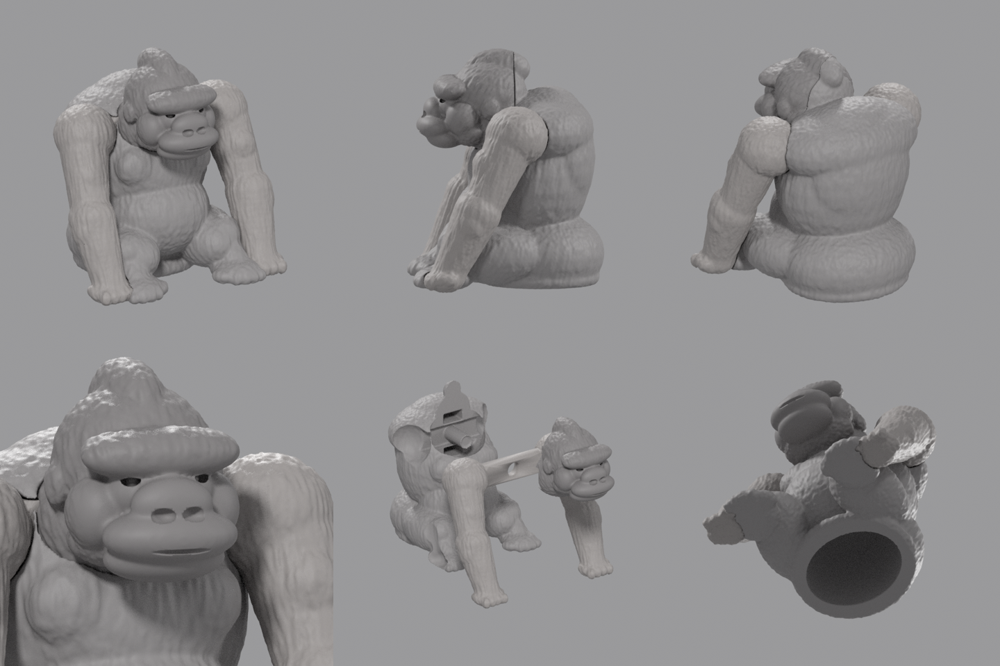
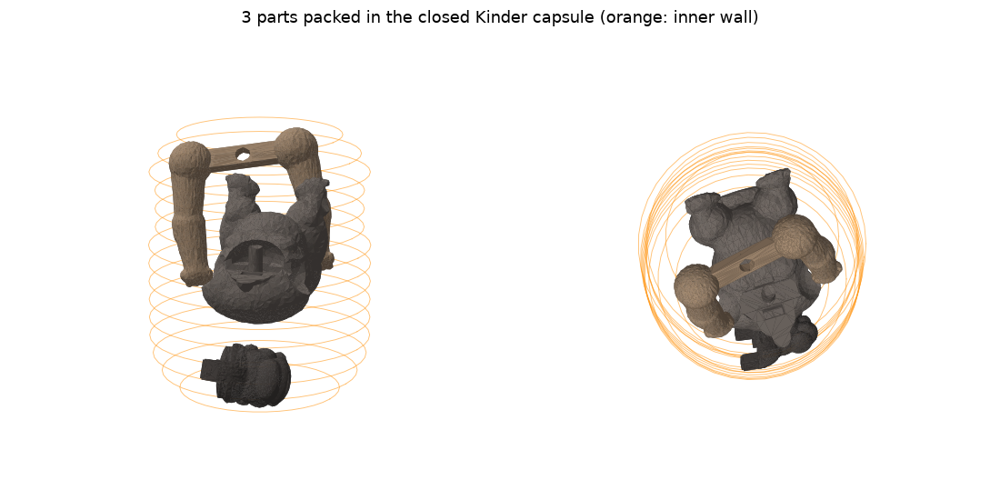

# 健达奇趣蛋玩具：拟真大猩猩（3 个零件，Blender 建模）

一只坐姿的银背大猩猩：双手指节撑地，有矢状脊、厚重的眉骨、深陷的眼睛、宽鼻子和外张的鼻孔、突出的嘴部、毛发纹理和肌肉。由 3 个注塑 ABS 零件组成，**没有金属件**，小朋友徒手就能按上。

## 1. 在 Blender 里生成
- Blender 4.2 及以上（4.5 / 5.x 推荐，有 Manifold 布尔求解器，更快）。
- 打开 Scripting 工作区 → Open `gorilla_blender_build.py` → Run Script。
  - 结果在 `Gorilla_Assembled`（组装状态）和 `Gorilla_Exploded`（拆开状态）两个集合里。
  - 单位是毫米（场景单位已经设成 mm）。
- 也可以在命令行运行：`blender -b -P gorilla_blender_build.py -- --out 输出文件夹`。会导出 3 个 STL 和 `kinder_gorilla.blend`。
- 全部参数都在文件顶部的 `P` 字典里：
  - `SCALE`：整体大小
  - `VOXEL`：细节精度
  - `FUR_*`：毛发纹理
  - `PEG_*`、`TAB_*`、`BAND_*`：连接结构
  - `CAVITY`：身体掏空
  
  造型本身在 `body_elems` / `head_elems` / `arm_elems` / `FACE` 里，每个肌肉块都是一行，可以直接改。
- 完整精度生成一次约 10 分钟（Manifold 求解器，CPU）。调造型时可以把 `VOXEL` 设成 0.3，一分钟左右就能看效果（`sculpt_preview.py` 只渲染造型）。
- 现成的结果：`out/kinder_gorilla.blend`、`out/P1_BODY.stl`、`out/P2_ARMS.stl`、`out/P3_HEAD.stl`。

建模方法：先用椭球体和渐细的胶囊体（每块肌肉、每个指节一个）拼出形体，再用体素重构把它们融合成一体，然后按部位分别平滑（头部保留清晰的五官，身体更柔和）。毛发是沿毛流方向拉长的噪声位移，脸部不加毛发。五官（眼窝、眼球、鼻孔、嘴缝）用布尔运算做出来。三个零件都是从**同一个完整雕塑**里切出来的，所以接缝只是细线。

## 2. 三个零件和连接方式（按你的草图）
| 编号 | 零件 | 尺寸 (mm) | ABS 重量 |
|---|---|---|---|
| P1 | 身体：背、肩峰、腹部、臀部、双腿；底部掏空，壁厚 ≥ 1.2 mm | 16.4 × 19.8 × 23.9 | 2.35 g |
| P2 | 前臂：两条手臂和胸前一条横带连成一体 | 23.3 × 12.8 × 19.0 | 0.77 g |
| P3 | 头和脖子 | 9.0 × 12.4 × 11.8 | 0.50 g |

组装后约 23 mm 宽、24 mm 高，总重约 3.6 g。

- **身体正面（脖子位置）**：中间一根 Ø2.0 的凸柱，上下各一个 3.1 × 1.5 mm 的插槽。
- **手臂**：胸前横带（3 × 1.6 mm）中间有一个孔，**挂在凸柱上**，横带嵌进身体上对应的凹槽。
- **头**：背面有两个带卡扣凸点的插舌（3.0 × 1.4，插进插槽，过盈 0.08 mm），一个凸柱座孔（比凸柱小 0.03 mm，轻压配合），还有一条容纳横带的凹槽。
- **安装（两步）**：
  1. 把手臂的横带挂到身体的凸柱上。
  2. 把头按上去，插舌进插槽，凸柱进座孔，横带被夹住，完成。
- **限位**：横带夹在上下两个插舌之间，手臂不会绕凸柱转。拆的时候直接把头拔下来。
- 所有连接结构都沿前后方向（Y 方向）。

## 3. 验证（在 Blender 5.0.1 里实际运行脚本后检查）
- 三个零件都是**单一、封闭（watertight）的实体**。脚本会自动清理布尔运算留下的碎片。
- 零件之间：
  - 身体/手臂、手臂/头之间零干涉。
  - 身体/头之间只有 0.43 mm³ 的重叠，就是有意设计的卡扣凸点和凸柱压配合。
- 身体掏空后壁厚基本都 ≥ 1.2 mm，只在底部边缘有 0.5 mm³ 的局部略薄。
- 用真实健达蛋壳内腔（和蝴蝶项目同一份蛋壳模型）做了装蛋检查：**三个零件能一起装进闭合的蛋里**，每处至少留 0.3 mm 间隙，零件之间零干涉（`pack_check.py`，见上图）。

## 4. 注塑（ABS）—— 需要注意的地方
用光线检查了每个零件沿三个方向开模时的倒扣面积：

| 零件 | 推荐开模方向 | 倒扣面积 | 说明 |
|---|---|---|---|
| 手臂 | 前后 | 约 0.3–5 % | 基本可以直接出模 |
| 头 | 左右 | 约 6 % | 背面的凸柱座孔需要 1 个小抽芯（沿 Y）；插舌和横带凹槽都和开模方向兼容 |
| 身体 | 前后，加底部抽芯（成型内腔） | 约 13 % | 倒扣集中在三处：脚趾/脚底、头部座位的局部凹形、横带凹槽。需要局部滑块，或者在这几处加拔模 |

- 毛发纹理对倒扣的影响很小（关掉毛发只少约 1–3 %）。量产时也可以改用模具蚀纹来做毛发。
- 拟真的小动物公仔一般都需要几个滑块。上面的数字可以作为和模具厂讨论的起点。
- 安全：没有尖角、没有金属。需要通过 EN 71 / ASTM F963 认证，包装警示“3 岁以下儿童不宜”。

## 5. 文件
| 文件 | 用途 |
|---|---|
| `gorilla_blender_build.py` | 主脚本（Blender），全部建模、切分、连接结构、掏空和检查 |
| `render_previews.py` | 渲染预览图（Cycles） |
| `sculpt_preview.py` | 快速只看造型 |
| `pack_check.py` | 装蛋检查（用真实蛋壳内腔） |
| `out/` | `.blend` 和 3 个 STL |
| `img/` | 预览图 |
