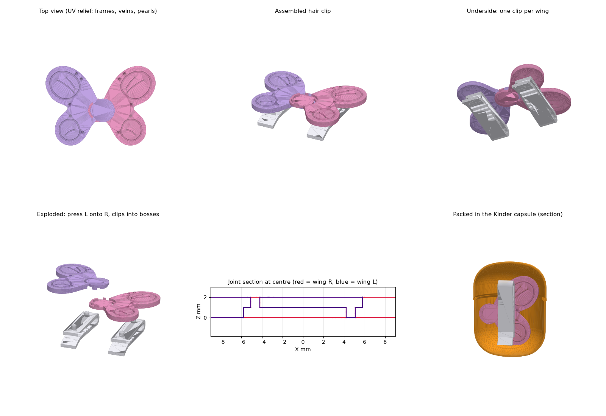
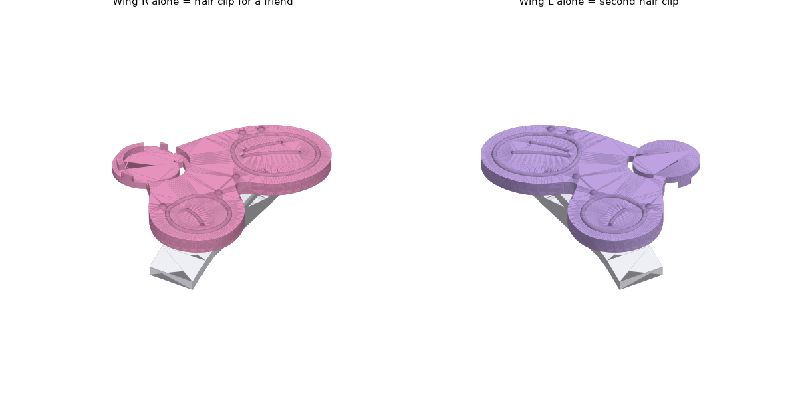

# 健达奇趣蛋玩具：童话公主蝴蝶发卡（4 个零件，全 ABS，无金属）

按手绘草图设计：两只翅膀在中间**重叠、互相卡住**（草图右上角的 WING CONNECT），每只翅膀下面各有一个发夹。
- **合体**：两只翅膀压在一起，就是一只蝴蝶发卡。
- **分开**：就是两个独立的发卡，可以分一个给好朋友。

## 1. 怎么在 Rhino 里生成（NURBS）
这个会话运行在云端容器里，**没法直接连到你电脑上的 Rhino 9**，所以模型以 RhinoCommon 脚本的形式提供，在你的 Rhino 里运行一次就会建出全部 NURBS 实体：

1. Rhino 9 WIP（7 和 8 也可以）→ 命令行输入 `RunPythonScript` → 选择 `rhino/princess_butterfly_rhino.py`。也可以在 ScriptEditor 里打开运行，Python 3 或 IronPython 都行。
2. 生成的图层（父图层 `KinderPrincess`）：

   | 图层 | 内容 |
   |---|---|
   | `Butterfly_Assembly` | 组装好的蝴蝶 |
   | `Butterfly_Exploded` | 爆炸图 |
   | `Parts` | 单个零件 |
   | `Egg_Closed` / `Egg_HalfOpen` / `Egg_Open` | 蛋壳三个状态 |
   | `Egg_Closed_Section` | 蛋壳剖面，里面装着玩具，在 Front 视图里能看到 |
   | `Packed_In_Egg` | 装蛋排布 |

3. 所有尺寸都在文件顶部的 `BF`（蝴蝶）和 `EGG`（蛋壳）两个字典里。改完重新运行，上一次生成的物体会自动被替换。
4. 命令行如果出现 `!!`，说明某一步布尔运算或圆角失败了，相关物体会放到 `_Debug` 图层。请把命令行输出发给我。

`out/*.step` 是用同一套数学在 CadQuery（OpenCascade）里建出来的 NURBS 实体，可以直接 `Import` 到 Rhino 作为对照。

## 2. 零件
| 编号 | 零件 | 数量 | 尺寸 (mm) | ABS 重量 |
|---|---|---|---|---|
| P1 | 右翅膀（拿中间重叠区的**下半层** + 一条向上的弧形卡舌） | 1 | 28.3 × 32.6 × 3.7 | 1.05 g |
| P2 | 左翅膀（拿重叠区的**上半层** + 一条向下的弧形卡舌） | 1 | 28.3 × 32.6 × 3.7 | 1.05 g |
| P3 | 发夹（一体式 ABS 弹片夹，两个完全相同） | 2 | 7.0 × 29.7 × 8.1 | 0.63 g |

组装后的蝴蝶约为 **45 × 32.6 mm**，翅膀厚 2.0 mm。

## 3. 结构
### 3.1 翅膀互卡（WING CONNECT）
- 每只翅膀的根部有一个 R4.8 的圆盘，伸到对方翅膀下面（或上面）。两只翅膀重叠的区域在 Z = 1.0 处分成上下两层：右翅膀拿下层，左翅膀拿上层。合体后上下表面都是平齐的，草图里那两个重叠的圆环就是这个区域。
- **两条弧形卡舌**，和各自的圆盘同心：
  - 右翅膀的卡舌向上，插进左翅膀上层的弧形槽里，从正面能看到一条弧线；
  - 左翅膀的卡舌向下，插进右翅膀下层的弧形槽里，从背面能看到一条弧线。
  - 两条卡舌配合起来，就是草图里那个 S / Z 形的互钩。
- **验证结果**（`verify.py`）：
  - 名义尺寸下两只翅膀零干涉。
  - 沿展开方向往外拉 0.5 mm，或沿 Y 方向滑动 0.5 mm，都会撞上（7.4 / 8.3 mm³）→ **锁住**。
  - 把左翅膀垂直往上提 → **没有干涉**，所以安装方向就是垂直按下。
- 卡舌和槽单边过盈 0.02 mm（`LIP_FIT`），靠摩擦夹紧，孩子用手指压下去就能卡上，掰开就能分开。弧形卡舌同时也防止两只翅膀相对转动。
- 所有侧壁都是竖直的，**没有倒扣**。翅膀用两板模直接开模即可，不需要滑块、斜顶或碰穿孔。

### 3.2 发夹
沿用上一版验证过的一体式 U 形弹片夹：
- 弹舌上有齿，按尾部的拇指片就能张开；弹舌应变约 0.8 %，ABS 可以反复使用。
- 发夹上的 2 根 Ø2.25 销压进翅膀底面 Ø5 凸台里的 Ø2.20 盲孔（凸台带 1° 拔模，顶端较细）。
- 左右翅膀的凸台位置是镜像的，所以**同一个发夹**两边通用，只需要开一个模腔。
- 发夹的分型面在宽度中线，整件没有倒扣。

### 3.3 UV 变色表面纹理（公主风格）
翅膀正面的凸起纹理全部是圆润的半圆截面，没有尖角：
- **每个翅瓣一圈内框**：R0.35 的半圆凸条，像彩绘玻璃的边框。
- **叶脉线**：R0.28，两端是圆头。
- **珍珠点**：R0.6 的半球，凸出 0.45 mm。

这些纹理和光面形成高低差，涂上 UV（光致变色）涂层后，阳光下会出现分区变色的效果。
- **建议**：直接把光致变色色母粒混进 ABS 里注塑，这样不会掉漆，也更容易通过 EN 71-3；如果用喷涂或移印涂层，需要做 EN 71-3 迁移测试。
- 程序已校验：所有纹理都在翅膀轮廓以内，并且不进入重叠区，所以合体后不会互相干涉。

## 4. 孩子的安装步骤
1. 把发夹的两根小柱子对准翅膀背面的两个圆凸台，按进去（两只翅膀各装一个）。
2. 把左翅膀（带上层的那只）对准右翅膀中间的圆盘，向下压，“咔”一声就卡好了，变成一整只蝴蝶。
3. 想分享时，把两只翅膀上下掰开，就是两个独立的发卡。

## 5. 装进健达蛋
排布方式：两只翅膀背靠背放在中间，两个发夹分别放在两侧，所有零件的长度方向都沿蛋的轴线。用真实的蛋壳模型（底座 + 盖子，壁厚 0.68）校验：
- 4 个零件全部在内腔里；
- 和壳体零干涉，最小间隙 0.80 mm；
- 零件之间也没有干涉。

## 6. 注塑 / DFM
| 项目 | 做法 |
|---|---|
| 材料 | ABS（建议混光致变色色母粒） |
| 壁厚 | 翅膀 2.0，重叠区上下各 1.0，卡舌宽 0.9，发夹 1.4 |
| 开模 | 翅膀沿 Z 方向两板模；发夹沿 X 方向，分型面在中线。全部零件都没有倒扣 |
| 拔模 | 凸台 1°；卡舌和槽的竖直壁建议在模具上补 0.5°（槽口一侧稍大，方便孩子插入） |
| 配合 | 卡舌单边过盈 0.02 mm，发夹销直径过盈 0.05 mm。试模后可以改 `LIP_FIT`、`CLIP_HOLE_D` 来调松紧 |
| 浇口 | 翅膀：潜伏浇口打在下翅瓣背面（凸台附近）；发夹：打在 U 形弯头外侧 |
| 安全 | 全部是圆角和圆头，没有尖点、没有金属。发卡属于头饰，需要做 EN 71-1 的拉力和小零件测试，包装标注“3 岁以下不宜” |

## 7. 文件
| 文件 | 说明 |
|---|---|
| `rhino/princess_butterfly_rhino.py` | **主文件**：RhinoCommon 参数化建模脚本（蝴蝶 + 蛋壳） |
| `verify.py` | 用 CadQuery 按同一套数学复建并校验，导出 STEP / STL |
| `render.py` | 生成预览图 |
| `out/P1_wing_R.step`, `P2_wing_L.step`, `P3_clip.step`, `princess_butterfly_assembly.step` | NURBS 实体（对照用） |
| `out/*.stl` | 3D 打印手板用 |
